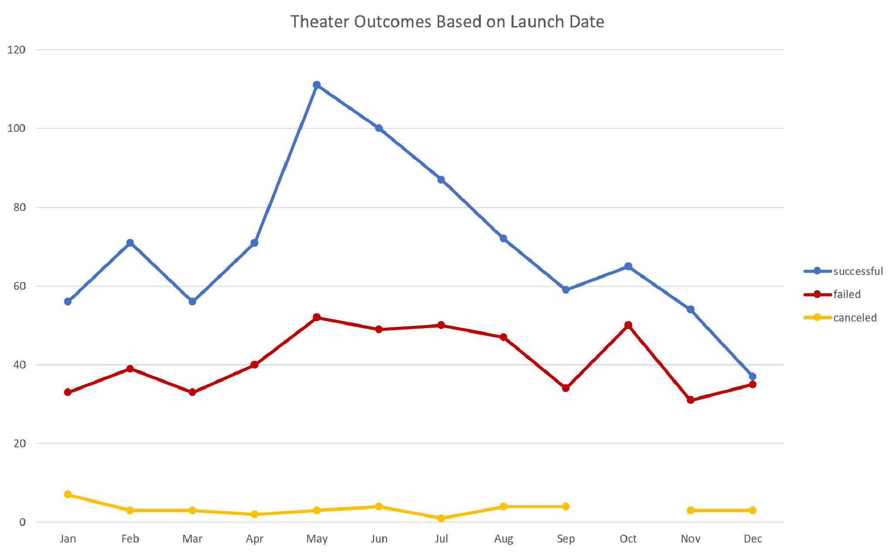
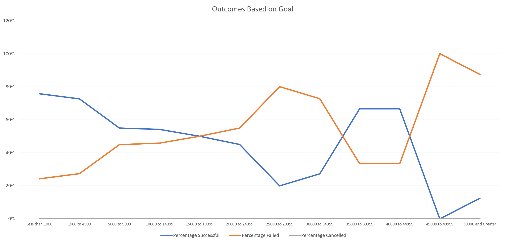

# Kickstarting with Excel

## Table of Contents
* [Overview of Project](https://github.com/rkaysen63/Kickstarter-Challenge/blob/main/README.md#overview-of-project)
* [Analysis and Challenges](https://github.com/rkaysen63/Kickstarter-Challenge/blob/main/README.md#analysis-and-challenges)
* [Results](https://github.com/rkaysen63/Kickstarter-Challenge/blob/main/README.md#results)

## Overview of Project

Previously, Louise, a playwright, had sought help with analyzing a large number of Kickstarter crowdfunding campaigns in order to determine the viability of her own crowdfunding campaign for a play that she wrote.  For her play, ***Fever***, she budgeted $10,000 and planned to open it in the U.S.  (https://github.com/rkaysen63/kickstarter-analysis)

In a short period of time, Louise's crowdfunding campaign for her play, ***Fever***, came close to its fundraising  goal and now she's interested in: 
* The relationship between crowdfunding campaign outcomes and their launch dates and 
* The relationship between crowdfunding campaign outcomes and their fundraising goals. (Premise from Bootcamp Module 1 Challenge.  Kickstarter Data downloaded from Bootcamp Module 1.1.3)

### Purpose

This project intends to analyze the relationships described above and identify trends in order to improve future crowdfunding efforts.  Excel and its functions and features were used to organize, convert and display the data in order to help visualize the results.  

## Analysis and Challenges

### Analysis of Outcomes Based on Launch Date

* In order to analyze outcomes based on launch date, the Unix timestamp data had to be converted into a readable day-month-year format.  First the UNIX timestamps in seconds were converted into days (60 secs/min, 60 secs/hour, 24 hours/day) and added to the date 1 January 1970 using Excel's *DATE* function.  (Bootcamp Module 1,3.3)

> >Formula for launch date conversion:  =(((*CELL W UNIX DATE STAMP*/60)/60)/24)+DATE(1970,1,1)

> >e.g. Timestamp in CELL J84 is 1429722209. 

> >Date =(((J84/60)/60)/24)+DATE(1970,1,1) = 4/22/2015

* For the purpose of sorting by year, an additional column was created to pull just the year from the launch date by using Excel's *YEAR* function.

> >Formula to pull years:  Year =YEAR(*CELL W LAUNCH DATE IN DAY-MONTH-YEAR FORMAT*)

> >e.g.  Date in CELL S84 is 4/22/2015.

> >Year =YEAR(S84) = 2015

* The Kickstarter crowdfunding data was organized by a pivot table in order to count the number of each type of outcome (successful, failed and cancelled) by month.  "Outcomes" were placed in the columns of the table and "Date Created Conversion" (i.e. Launch Dates) were place in the rows.  The table was set up to filter Parent Category and Years.  For Louise's purposes, only Theater campaigns were relevant, and therefore, the Parent Category was filtered to Theater but all years of the data were included in the final data set. 

### Analysis of Outcomes Based on Goals

For this analysis, a table was constructed in which the rows were labeled dollar-amount fundraising goal ranges, "Less than $1000," "$1000 to $4999", $5000 to $9999, etc. and the columns were labeled, "Number of Successful", "Number of Failed", "Number of Cancelled", "Total Projects", "Pecentage Successful", Percentage Failed", "Percentage Cancelled." 

* The *COUNTIFS* function was used to determine for each goal range, the number campaigns of a particular outcome (successful, failed, cancelled).  Since Louise was only interested in the outcomes of plays, only outcomes for "plays" were counted.

> >Formula to count successful outcomes of the campaigns for plays in the goal range of $5000 to $9999: =COUNTIFS(outcomes,"successful",goal,">=5000",goal,"<10000",Subcategory,"plays"), where outcomes=Kickstarter!$F:$F; goal=Kickstarter!$D:$D; Subcategory=Kickstarter!$R:$R.
> >
> >e.g.  Number of Successful Play Campaigns, $5000-$9999 =COUNTIFS(outcomes,"successful",goal,">=5000",goal,"<10000",Subcategory,"plays") = 93
> >
* Total Projects was the summation of the Number Successful, Number Failed, Number Cancelled for each goal range.

* Percentage Successful was calculated by dividing Number Successful/Total Projects for each goal range.  The number format for the column was set on percentage which multiplies the cell value by 100 and displays the result with a percentage symbol.  The same procedure was used to determine Percentage Failed and Percentage Cancelled. 

* A chart was created to visualize the Outcomes Based on Goal where the horizontal axis are goal ranges and the vertical axis are percentages.  Percentage Successful, Percentage Failed and Percentage Cancelled for each Goal are plotted on the chart.   

### Challenges and Difficulties Encountered

* The challenges in developing the Analysis of Outcomes Based on Launch Date includes the automatic filtering of quarters and years when I placed the "Date Created Conversion" into the rows and sorting the pivot table columns in descending order.  Both issues were resolved by trial and error until I achieved the desired result.  

* The biggest challenge in developing the Analysis of Outcomes Base on Goal was setting up the *COUNTIFS* statement.  It was eventually accomplished through trial and error and through Google search for "Excel Countifs."

## Results

- What are two conclusions you can draw about the Outcomes based on Launch Date?

- What can you conclude about the Outcomes based on Goals?

- What are some limitations of this dataset?

- What are some other possible tables and/or graphs that we could create?

* [Table of Contents](https://github.com/rkaysen63/Kickstarter-Challenge/blob/main/README.md#table-of-contents)
